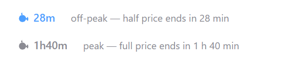

# hermes-desktop-deepseek-offpeak-status

A whale in the Hermes Desktop status bar that shows, at a glance, whether DeepSeek tokens are half price right now — plus a small agent tool that answers the same question in chat.



## What it does

DeepSeek charges half price outside its peak hours. This plugin turns that into something you can see without thinking about it — the chip sits in the bottom-right status bar, next to the cache and context readouts.

- 🐋 **Blue whale** — off-peak right now: tokens cost half. A good moment to start a long job.
- 🐋 **Grey whale** — peak: full price.
- **The number next to it** — how long until the rate changes, so you know whether waiting pays.
- **Hover it** — which rate is running, and the exact time it flips.

It reads your clock and nothing else: no network calls, no account, no config file, and it never touches your requests. It just makes the cheap hours visible.

**Agent half** — the same state, on demand:

```
deepseek_rate_status  →  { "period": "off-peak", "rates": "half price (50% off peak)",
                           "switches_to": "peak", "time_until_switch": "1h40m", ... }
```

Ask the agent *"is now a cheap time to run this?"* and it can call the tool instead of guessing — handy before a long or bulk job.

## Install

### Desktop chip

With Hermes Desktop installed, one click:

**[Install in Hermes](hermes://plugin/install?repo=aimagist/hermes-desktop-deepseek-offpeak-status)**

The dialog detects both halves; tick the desktop component and it lands in `<hermes home>/desktop-plugins/hermes-desktop-deepseek-offpeak-status/`.

By hand — no dependencies, no build step:

```bash
git clone https://github.com/aimagist/hermes-desktop-deepseek-offpeak-status /tmp/dosp
mkdir -p "<hermes home>/desktop-plugins/hermes-desktop-deepseek-offpeak-status"
cp /tmp/dosp/desktop/plugin.js "<hermes home>/desktop-plugins/hermes-desktop-deepseek-offpeak-status/"
```

The app watches that folder and hot-reloads on every save. If the chip doesn't show up, run **⌘K → Reload desktop plugins**.

### Agent tool

```bash
hermes plugins install aimagist/hermes-desktop-deepseek-offpeak-status
hermes plugins enable hermes-desktop-deepseek-offpeak-status
```

That installs the package into `<hermes home>/plugins/<name>/` and the status tool is available to the agent after a restart. Nothing to configure, no API keys, no network.

## Your cheap hours

Wherever you are, the useful question is: **when are tokens half price on my clock?** The schedule is defined in UTC, so here it is converted. Every row adds up to 24 hours.

🟢 **half price** · 🔴 **full price**

| 🌍 Where (your clock) | 🟢 Main cheap window — 15 h | 🟢 Short cheap window — 2 h | 🔴 Full price — 7 h |
|---|---|---|---|
| 🌐 **UTC** — the reference (UTC+0) | 10:00 – 01:00 → | 04:00 – 06:00 | 01:00 – 04:00 · 06:00 – 10:00 |
| ![AR][ar] **Buenos Aires** · ![BR][br] **São Paulo** (UTC−3) | 07:00 – 22:00 | 01:00 – 03:00 | 03:00 – 07:00 · 22:00 – 01:00 → |
| ![US][us] **US Eastern** (UTC−4 / UTC−5) | 06:00 – 21:00<br>05:00 – 20:00 | 00:00 – 02:00<br>23:00 – 01:00 → | 02:00 – 06:00 · 21:00 – 00:00<br>01:00 – 05:00 · 20:00 – 23:00 |
| ![US][us] **US Central** (UTC−5 / UTC−6) | 05:00 – 20:00<br>04:00 – 19:00 | 23:00 – 01:00 →<br>22:00 – 00:00 | 01:00 – 05:00 · 20:00 – 23:00<br>00:00 – 04:00 · 19:00 – 22:00 |
| ![US][us] **US Mountain** (UTC−6 / UTC−7) | 04:00 – 19:00<br>03:00 – 18:00 | 22:00 – 00:00<br>21:00 – 23:00 | 00:00 – 04:00 · 19:00 – 22:00<br>18:00 – 21:00 · 23:00 – 03:00 → |
| ![US][us] **US Pacific** (UTC−7 / UTC−8) | 03:00 – 18:00<br>02:00 – 17:00 | 21:00 – 23:00<br>20:00 – 22:00 | 18:00 – 21:00 · 23:00 – 03:00 →<br>17:00 – 20:00 · 22:00 – 02:00 → |
| ![GB][gb] **London** (UTC+1 / UTC+0) | 11:00 – 02:00 →<br>10:00 – 01:00 → | 05:00 – 07:00<br>04:00 – 06:00 | 02:00 – 05:00 · 07:00 – 11:00<br>01:00 – 04:00 · 06:00 – 10:00 |
| ![DE][de] ![FR][fr] ![ES][es] **Central Europe** — Berlin · Paris · Madrid (UTC+2 / UTC+1) | 12:00 – 03:00 →<br>11:00 – 02:00 → | 06:00 – 08:00<br>05:00 – 07:00 | 03:00 – 06:00 · 08:00 – 12:00<br>02:00 – 05:00 · 07:00 – 11:00 |
| ![IN][in] **India** (UTC+5:30) | 15:30 – 06:30 → | 09:30 – 11:30 | 06:30 – 09:30 · 11:30 – 15:30 |
| ![CN][cn] ![SG][sg] ![AU][au] **China · Singapore · Perth** (UTC+8) | 18:00 – 09:00 → | 12:00 – 14:00 | 09:00 – 12:00 · 14:00 – 18:00 |
| ![JP][jp] ![KR][kr] **Japan · Korea** (UTC+9) | 19:00 – 10:00 → | 13:00 – 15:00 | 10:00 – 13:00 · 15:00 – 19:00 |
| ![AU][au] **Sydney** (UTC+11 / UTC+10) | 21:00 – 12:00 →<br>20:00 – 11:00 → | 15:00 – 17:00<br>14:00 – 16:00 | 12:00 – 15:00 · 17:00 – 21:00<br>11:00 – 14:00 · 16:00 – 20:00 |

[ar]: https://flagcdn.com/20x15/ar.png
[au]: https://flagcdn.com/20x15/au.png
[br]: https://flagcdn.com/20x15/br.png
[cn]: https://flagcdn.com/20x15/cn.png
[de]: https://flagcdn.com/20x15/de.png
[es]: https://flagcdn.com/20x15/es.png
[fr]: https://flagcdn.com/20x15/fr.png
[gb]: https://flagcdn.com/20x15/gb.png
[in]: https://flagcdn.com/20x15/in.png
[jp]: https://flagcdn.com/20x15/jp.png
[kr]: https://flagcdn.com/20x15/kr.png
[sg]: https://flagcdn.com/20x15/sg.png
[us]: https://flagcdn.com/20x15/us.png

That is the whole story: **17 cheap hours and 7 full-price hours** every UTC weekday. The 15-hour window is where a long job belongs; the 2-hour one is the gap *between* the two full-price blocks — worth grabbing when something has to run on a peak day.

**Reading it:** a city with two offsets (`UTC−4 / −5`) carries two times on two lines in every cell — the first line for the first offset, the second for the second. The schedule is pinned to UTC, so your clock times slide an hour when DST changes; Sydney's `+11` line is January. `→` means the window runs past midnight and ends the next morning.

Two things worth knowing:

- **In the Americas the week starts on Sunday evening.** The days are UTC days, so the Monday peak blocks land Sunday night in New York, São Paulo and further west. Your long cheap run — the weekend — starts at Friday 10:00 UTC, which is anywhere from Friday morning to Friday night on your own clock.
- **The peak windows are a Chinese working day.** 09:00–12:00 and 14:00–18:00 in Beijing is 9-to-noon and 2-to-6, split by lunch. DeepSeek charges peak while its home country is at its desk.

The windows come straight from DeepSeek's own [Models & Pricing page](https://api-docs.deepseek.com/quick_start/pricing) (footnote 1):

> Off-peak rates are half of the peak rates. Peak hours are 01:00 - 04:00 and 06:00 - 10:00 UTC, Monday through Friday (all other hours are off-peak).

That page is also where the per-model peak/off-peak table lives, so it is the one to re-check when rates move.

Hovering the chip gives the state in two lines:

```
Off-peak · 50% off
Ends Mon 01:00 · in 2d 15h
```

## What ships

| Path | Half | What it is |
|---|---|---|
| `desktop/plugin.js` | Desktop | The status-bar chip. Plain ESM, loaded by the app at runtime. |
| `plugin.yaml` | Agent | Manifest: the one tool this package provides. |
| `__init__.py` | Agent | The tool itself — `deepseek_rate_status`, stdlib only. |
| `offpeak.test.mjs` | — | 22 schedule checks for the chip: `node offpeak.test.mjs`. |
| `tools/tz-table.mjs` | — | Prints the timezone table above, from real IANA zones — `node tools/tz-table.mjs`. |
| `tools/chip-sample.html` | — | The source of the header image (`assets/chip.png`). |
| `tools/chip-preview.html` | — | Both chip states with their hover tooltips. |

## Make it yours

One constant in `desktop/plugin.js`, mirrored in `__init__.py`:

```js
/** Peak windows in UTC hours. `[from, to)` — `to` is exclusive. */
const PEAK_WINDOWS = [
  [1, 4],
  [6, 10]
]
```

Change the hours, change the days (the weekend check is the `weekday() >= 5` / `day === 0 || day === 6` line), run both checks, done. There is no config file and no backend to run.

The blue is `var(--ui-accent)` — the accent of your active theme, blue on the default skin. Replace it with a fixed hex if you'd rather it never change with the theme.

## Develop

```bash
node offpeak.test.mjs     # 22 checks: windows, next-switch math, formatting
python __init__.py        # 8 checks: the agent half's own view of the schedule
hermes plugins validate . # the catalog admission gate
```

The JS test pulls the chip's pure functions out of `desktop/plugin.js` and evaluates them without the SDK. It has to work that way: a runtime plugin is loaded as plain ESM with no build step, so `desktop/plugin.js` may import **only** `@hermes/plugin-sdk`, `react`, and `react/jsx-runtime` — which is exactly what keeps its logic import-free and testable with `node`.

## Scope

- Two halves, both optional: the chip works alone, the tool works alone.
- The schedule is this plugin's own arithmetic on UTC clock time, not a feed. If DeepSeek changes its windows or its rates ([pricing page](https://api-docs.deepseek.com/quick_start/pricing)), edit `PEAK_WINDOWS` in both halves.
- The status bar gets the theme's accent, not a hardcoded blue (see above).
- Catalog status: admission-ready — `hermes plugins validate` passes — pending a reviewed entry.

## License

MIT
